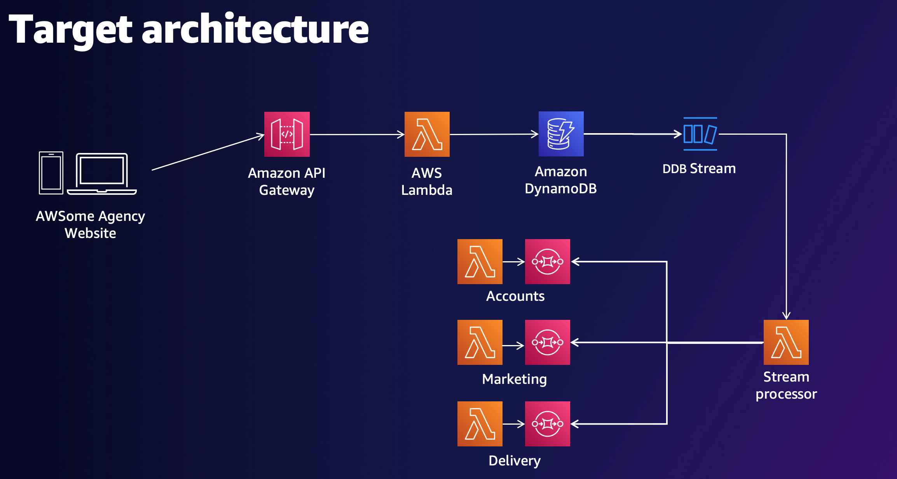

# AWSome Agency

AWSome Agency is a Digital B2B Agency that wants to allow ordering digital products online.

1/ There is a static SPA website Vite + React deployed to S3 + CloudFront.  
2/ The API is a HTTP API running in API Gateway and Lambda.  
3/ tRPC is used in the API layer for e-2-e type safety.  
4/ Data is stored in DynamoDB with Lambda processing the stream.  
5/ Events go to Domain specific SQS queues and are processed by Lambda.
NB/ Only te Marketing SQS is set up and sends a slack message when a new Order is created.



```
# If you have a slack URL to use you can store in SSM Param store with the below CLI command - replace value with actual slack url.

aws ssm put-parameter \
    --name "/awesome-agency/slack-url" \
    --type "String" \
    --value "/services/UUID1/UUID2/UUID2" \
    --overwrite
```

This is a mono-repo with workspaces for web and services. Dependencies are managed at the top level project.

## Built with CDK

## Main Project commands

- `yarn cdk deploy --all` deploy all stack
- `yarn cdk destroy --all` remove all stacks
- `yarn test` remove all stacks

## Web Project commands

- `cd web` go to web folder
- `yarn dev` run the Vite react site locally
- `yarn css` start tailwind css watcher

## Services Project

- Store domain logic in the core folder under Marketing, Accounts etc.
- You can unit test your domain specific logic here.
- For Lambda handler functions store in the functions folder.
- Import domain logic into the handler functions where needed.

## Other useful CDK commands below:

- `npm run build` compile typescript to js
- `npm run watch` watch for changes and compile
- `npm run test` perform the jest unit tests
- `cdk deploy` deploy this stack to your default AWS account/region
- `cdk diff` compare deployed stack with current state
- `cdk synth` emits the synthesized CloudFormation template
